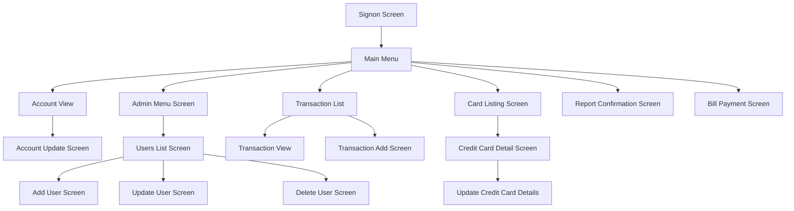

# UI Flow (from AI analysis)

## Diagram

## Insights
- Main Menu is the central hub for navigation.
- Admin Menu links to user management screens.
- Transaction List allows navigation to view or add transactions.
- Bill Payment and Report Confirmation are accessible from Main Menu.
