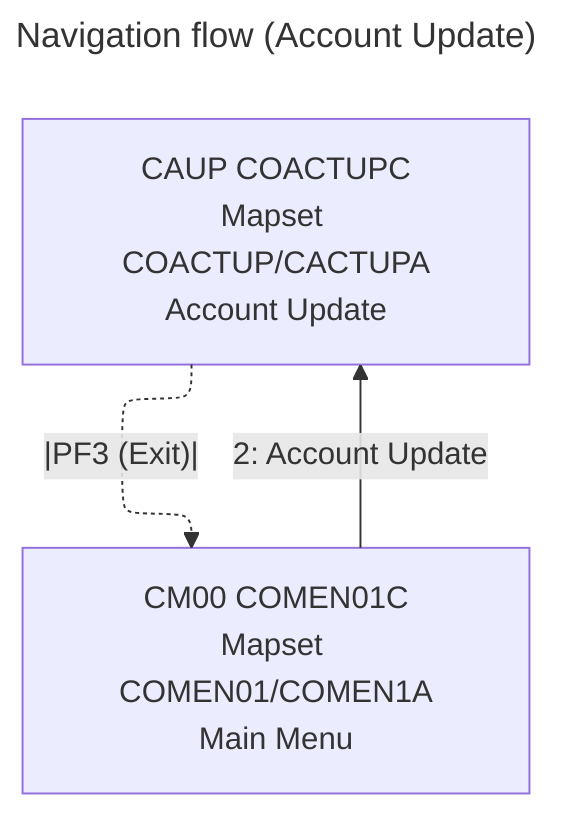

# COACTUP — Account Update

- __Transaction ID__: CAUP (from `LIT-THISTRANID` in `app/cbl/COACTUPC.cbl`)
- __Program__: `COACTUPC`
- __BMS Mapset/Map__: `COACTUP` / `CACTUPA`
- __Datasets__:
  - `ACCTDAT` (Account Master) — READ when loading (`9300-GETACCTDATA-BYACCT`), then READ UPDATE + REWRITE during save (`9600-WRITE-PROCESSING`).
  - `CUSTDAT` (Customer Master) — READ when loading (`9400-GETCUSTDATA-BYCUST`), then READ UPDATE + REWRITE during save (`9600-WRITE-PROCESSING`).
  - `CXACAIX` (Card Xref by Account Index) — READ to resolve account → customer (`9200-GETCARDXREF-BYACCT`).
  - Notes: `CARDDAT`/`CARDAIX` literals exist but are not used in this program’s update flow.
- __PF-Keys__:
  - ENTER: Processes input. If account not yet loaded and account number provided, validates and fetches details; if details shown, validates edits and sets confirmation prompt (`1000-PROCESS-INPUTS`, `2000-DECIDE-ACTION`). If PF-key input is invalid for the current state, program forces ENTER handling (PFK gate).
  - PF5: Save — only valid when `ACUP-CHANGES-OK-NOT-CONFIRMED` is set; triggers `9600-WRITE-PROCESSING` (READ UPDATE + REWRITE `ACCTDAT`/`CUSTDAT`) with conflict/lock checks.
  - PF12: Cancel — only valid when details are loaded (`NOT ACUP-DETAILS-NOT-FETCHED`) and account filter is valid; discards edits by re-reading current data (`9000-READ-ACCT`).
  - PF3: Exit — `XCTL` to the calling program or to Main Menu (`COMEN01C`/`CM00`); program issues a `SYNCPOINT` prior to transfer.

## UI elements (extracted from `app/bms/COACTUP.bms`)

- __Static labels__:
  - "Tran:" at (1,1) — blue
  - "Date:" at (1,65) — blue
  - "Prog:" at (2,1) — blue
  - "Time:" at (2,65) — blue
  - "Update Account" at (4,33) — neutral
  - "Account Number :" at (5,19) — turquoise
  - "Active Y/N: " at (5,57) — turquoise
  - "Opened :" at (6,8) — turquoise
  - "Credit Limit        :" at (6,39) — turquoise
  - "Expiry :" at (7,8) — turquoise
  - "Cash credit Limit   :" at (7,39) — turquoise
  - "Reissue:" at (8,8) — turquoise
  - "Current Balance     :" at (8,39) — turquoise
  - "Current Cycle Credit:" at (9,39) — turquoise
  - "Account Group:" at (10,8) — turquoise
  - "Current Cycle Debit :" at (10,39) — turquoise
  - "Customer Details" at (11,32) — neutral
  - "Customer id  :" at (12,8) — turquoise
  - "SSN:" at (12,49) — turquoise
  - "Date of birth:" at (13,8) — turquoise
  - "FICO Score:" at (13,49) — turquoise
  - "First Name" at (14,1) — turquoise
  - "Middle Name: " at (14,28) — turquoise
  - "Last Name : " at (14,55) — turquoise
  - "Address:" at (16,1) — turquoise
  - "State " at (16,63) — turquoise
  - "Zip" at (17,63) — turquoise
  - "City " at (18,1) — turquoise
  - "Country" at (18,63) — turquoise
  - "Phone 1:" at (19,1) — turquoise
  - "Government Issued Id Ref    : " at (19,24) — turquoise
  - "Phone 2:" at (20,1) — turquoise
  - "EFT Account Id: " at (20,24) — turquoise
  - "Primary Card Holder Y/N:" at (20,53) — turquoise
  - Footer "ENTER=Process F3=Exit F5=Save F12=Cancel" along row 24 — yellow/dark

- __Fields__:
  - `TRNNAME` length 4 at (1,7) — blue, ASKIP FSET
  - `TITLE01` length 40 at (1,21) — yellow, ASKIP FSET
  - `CURDATE` length 8 at (1,71) — blue, ASKIP FSET, init 'mm/dd/yy'
  - `PGMNAME` length 8 at (2,7) — blue, ASKIP FSET
  - `TITLE02` length 40 at (2,21) — yellow, ASKIP FSET
  - `CURTIME` length 8 at (2,71) — blue, ASKIP FSET, init 'hh:mm:ss'
  - `ACCTSID` length 11 at (5,38) — green, UNPROT, IC, underline (account number input)
  - `ACSTTUS` length 1 at (5,70) — UNPROT, underline (Active Y/N)
  - `OPNYEAR` length 4 at (6,17) — UNPROT FSET, underline, RIGHT justify
  - `OPNMON` length 2 at (6,24) — UNPROT, underline, RIGHT justify
  - `OPNDAY` length 2 at (6,29) — UNPROT, underline, RIGHT justify
  - `ACRDLIM` length 15 at (6,61) — UNPROT FSET, underline
  - `EXPYEAR` length 4 at (7,17) — UNPROT, underline, RIGHT justify
  - `EXPMON` length 2 at (7,24) — UNPROT, underline, RIGHT justify
  - `EXPDAY` length 2 at (7,29) — UNPROT, underline, RIGHT justify
  - `ACSHLIM` length 15 at (7,61) — UNPROT FSET, underline
  - `RISYEAR` length 4 at (8,17) — UNPROT, underline, RIGHT justify
  - `RISMON` length 2 at (8,24) — UNPROT, underline, RIGHT justify
  - `RISDAY` length 2 at (8,29) — UNPROT, underline, RIGHT justify
  - `ACURBAL` length 15 at (8,61) — UNPROT FSET, underline
  - `ACRCYCR` length 15 at (9,61) — UNPROT FSET, underline
  - `AADDGRP` length 10 at (10,23) — UNPROT, underline
  - `ACRCYDB` length 15 at (10,61) — UNPROT FSET, underline
  - `ACSTNUM` length 9 at (12,23) — UNPROT, underline (customer id)
  - `ACTSSN1`/`ACTSSN2`/`ACTSSN3` lengths 3/2/4 at (12,55/61/66) — UNPROT, underline (SSN segments)
  - `DOBYEAR` length 4 at (13,23) — UNPROT, underline, RIGHT justify
  - `DOBMON` length 2 at (13,30) — UNPROT, underline, RIGHT justify
  - `DOBDAY` length 2 at (13,35) — UNPROT, underline, RIGHT justify
  - `ACSTFCO` length 3 at (13,62) — UNPROT, underline
  - `ACSFNAM` length 25 at (15,1) — UNPROT, underline
  - `ACSMNAM` length 25 at (15,28) — UNPROT, underline
  - `ACSLNAM` length 25 at (15,55) — UNPROT, underline
  - `ACSADL1` length 50 at (16,10) — UNPROT, underline
  - `ACSSTTE` length 2 at (16,73) — UNPROT, underline
  - `ACSADL2` length 50 at (17,10) — UNPROT, underline
  - `ACSZIPC` length 5 at (17,73) — UNPROT, underline, RIGHT justify
  - `ACSCITY` length 50 at (18,10) — UNPROT, underline
  - `ACSCTRY` length 3 at (18,73) — UNPROT, underline
  - `ACSPH1A`/`ACSPH1B`/`ACSPH1C` lengths 3/3/4 at (19,10/14/18) — UNPROT, underline, RIGHT justify (phone 1)
  - `ACSGOVT` length 20 at (19,58) — UNPROT, underline (government id)
  - `ACSPH2A`/`ACSPH2B`/`ACSPH2C` lengths 3/3/4 at (20,10/14/18) — UNPROT, underline, RIGHT justify (phone 2)
  - `ACSEFTC` length 10 at (20,41) — UNPROT, underline (EFT acct id)
  - `ACSPFLG` length 1 at (20,78) — UNPROT, underline (primary card holder Y/N)
  - `INFOMSG` length 45 at (22,23) — neutral, ASKIP (info banner)
  - `ERRMSG` length 78 at (23,1) — red, bright, FSET (error/message area)
  - Footer keys: `FKEYS` ('ENTER=Process F3=Exit'), `FKEY05` ('F5=Save'), `FKEY12` ('F12=Cancel') at row 24

- __Footer key visibility__:
  - Default: `FKEY05`/`FKEY12` are DRK in the map (`app/bms/COACTUP.bms` DFHMDF `ATTRB=(ASKIP,DRK)`).
  - On confirmation prompt: program sets them to bright via attribute moves: `MOVE DFHBMASB TO FKEY05A OF CACTUPAI` and `MOVE DFHBMASB TO FKEY12A OF CACTUPAI` (`app/cbl/COACTUPC.cbl`, around `PROMPT-FOR-CONFIRMATION`).

- __Notes__:
  - Mapset `COACTUP` — DFHMSD: LANG=COBOL, MODE=INOUT, STORAGE=AUTO, TIOAPFX=YES, DSATTS=(COLOR,HILIGHT,PS,VALIDN)
  - Map `CACTUPA` — CTRL=(FREEKB), MAPATTS=(COLOR,HILIGHT,PS,VALIDN)

## Behavior and flow (from `app/cbl/COACTUPC.cbl`)

- __Initial entry__: From Main Menu (`COMEN01C`) first time, program initializes, sends initial map (`3000-SEND-MAP`), sets `CDEMO-PGM-REENTER`, and returns to CICS (`COMMON-RETURN`).
- __Search and display__: When account number (`ACCTSID`) is provided and ENTER is pressed, program validates `ACCTSID`, reads xref `CXACAIX`, then reads `ACCTDAT` and `CUSTDAT` (`9000-READ-ACCT`) and displays populated details.
- __Editing__: After details are shown, ENTER validates edits (`1200-EDIT-MAP-INPUTS`). If valid, program sets `ACUP-CHANGES-OK-NOT-CONFIRMED`, brightens footer F5/F12, and prompts for confirmation.
- __Save__: On PF5 with `ACUP-CHANGES-OK-NOT-CONFIRMED`, `9600-WRITE-PROCESSING` does READ UPDATE then REWRITE of `ACCTDAT` and `CUSTDAT` with conflict/lock checks; success sets `ACUP-CHANGES-OKAYED-AND-DONE`; failures set flags (`COULD-NOT-LOCK-*`, `DATA-WAS-CHANGED-BEFORE-UPDATE`, `LOCKED-BUT-UPDATE-FAILED`) and messages.
- __Cancel__: On PF12 (valid only when details are loaded), discards staged edits by re-reading current data (`9000-READ-ACCT`).
- __Exit__: On PF3, sets target to caller or `COMEN01C` and `XCTL`s with preserved `CARDDEMO-COMMAREA`.
- __Commit/rollback__: Uses `SYNCPOINT` on normal exit; uses `SYNCPOINT ROLLBACK` if post-account REWRITE the customer REWRITE fails (ensuring atomicity of the two updates).

## Navigation flow (Account Update)

- __Sources__
  - Transaction and program literals in `app/cbl/COACTUPC.cbl`: `LIT-THISTRANID`='CAUP', `LIT-THISPGM`='COACTUPC', `LIT-THISMAPSET`='COACTUP', `LIT-THISMAP`='CACTUPA'.
  - XREF and datasets: READ of `CXACAIX` in `9200-GETCARDXREF-BYACCT`; READ of `ACCTDAT`/`CUSTDAT` on load (`9300-GETACCTDATA-BYACCT`, `9400-GETCUSTDATA-BYCUST`); READ UPDATE + REWRITE in `9600-WRITE-PROCESSING`.
  - PF-key handling: gating block validates `ENTER`/`PF3`/`PF5`/`PF12`; PF3 exit via `XCTL`; PF5 save only when `ACUP-CHANGES-OK-NOT-CONFIRMED`; PF12 cancel reload when details present.
  - Footer toggling: `PROMPT-FOR-CONFIRMATION` moves `DFHBMASB` to `FKEY05A`/`FKEY12A` to brighten save/cancel options.

