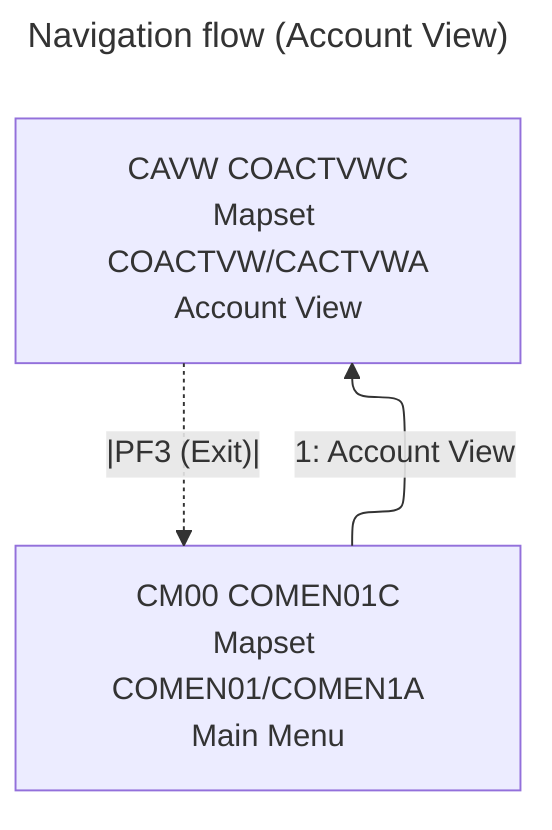

# COACTVW — Account View

- __Transaction ID__: CAVW (from `LIT-THISTRANID` in `app/cbl/COACTVWC.cbl`)
- __Program__: `COACTVWC`
- __BMS Mapset/Map__: `COACTVW` / `CACTVWA`
- __Datasets__: `ACCTDAT` (Account Master), `CARDDAT` (Card Master), `CUSTDAT` (Customer Master), `CARDAIX` (Card-by-Account Index), `CXACAIX` (Card Xref by Account Index)
- __PF-Keys__:
  - ENTER: If first entry, sends initial map; on re-enter, validates input and displays account details (`2000-PROCESS-INPUTS`, `9000-READ-ACCT`).
  - PF3: Exit — returns to caller if provided, else main menu `COMEN01C` (XCTL with preserved context).

## UI elements (extracted from `app/bms/COACTVW.bms`)

- __Static labels__:
  - "Tran:" at (1,1) — blue
  - "Date:" at (1,65) — blue
  - "Prog:" at (2,1) — blue
  - "Time:" at (2,65) — blue
  - "View Account" at (4,33) — neutral
  - "Account Number :" at (5,19) — turquoise
  - "Active Y/N: " at (5,57) — turquoise
  - "Opened:" at (6,8) — turquoise
  - "Credit Limit        :" at (6,39) — turquoise
  - "Expiry:" at (7,8) — turquoise
  - "Cash credit Limit   :" at (7,39) — turquoise
  - "Reissue:" at (8,8) — turquoise
  - "Current Balance     :" at (8,39) — turquoise
  - "Current Cycle Credit:" at (9,39) — turquoise
  - "Account Group:" at (10,8) — turquoise
  - "Customer Details" at (11,32) — neutral
  - "Customer id  :" at (12,8) — turquoise
  - "SSN:" at (12,49) — turquoise
  - "Date of birth:" at (13,8) — turquoise
  - "FICO Score:" at (13,49) — turquoise
  - "First Name" at (14,1) — turquoise
  - "Middle Name: " at (14,28) — turquoise
  - "Last Name : " at (14,55) — turquoise
  - "Address:" at (16,1) — turquoise
  - "State " at (16,63) — turquoise
  - "Zip" at (17,63) — turquoise
  - "City " at (18,1) — turquoise
  - "Country" at (18,63) — turquoise
  - "Phone 1:" at (19,1) — turquoise
  - "Government Issued Id Ref    : " at (19,24) — turquoise
  - "Phone 2:" at (20,1) — turquoise
  - "EFT Account Id: " at (20,24) — turquoise
  - "Primary Card Holder Y/N:" at (20,53) — turquoise
  - Footer "F3=Exit" at (24,1) — turquoise

- __Fields__:
  - `TRNNAME` length 4 at (1,7) — blue, ASKIP FSET
  - `TITLE01` length 40 at (1,21) — yellow, ASKIP FSET
  - `CURDATE` length 8 at (1,71) — blue, ASKIP FSET, init 'mm/dd/yy'
  - `PGMNAME` length 8 at (2,7) — blue, ASKIP FSET
  - `TITLE02` length 40 at (2,21) — yellow, ASKIP FSET
  - `CURTIME` length 8 at (2,71) — blue, ASKIP FSET, init 'hh:mm:ss'
  - `ACCTSID` length 11 at (5,38) — green, UNPROT, IC, underline, PICIN '99999999999', VALIDN(MUSTFILL)
  - `ACSTTUS` length 1 at (5,70) — underline, ASKIP (display-only Y/N)
  - `ADTOPEN` length 10 at (6,17) — underline
  - `ACRDLIM` length 15 at (6,61) — underline, RIGHT justify, PICOUT '+ZZZ,ZZZ,ZZZ.99'
  - `AEXPDT` length 10 at (7,17) — underline
  - `ACSHLIM` length 15 at (7,61) — underline, RIGHT justify, PICOUT '+ZZZ,ZZZ,ZZZ.99'
  - `AREISDT` length 10 at (8,17) — underline
  - `ACURBAL` length 15 at (8,61) — underline, RIGHT justify, PICOUT '+ZZZ,ZZZ,ZZZ.99'
  - `ACRCYCR` length 15 at (9,61) — underline, RIGHT justify, PICOUT '+ZZZ,ZZZ,ZZZ.99'
  - `AADDGRP` length 10 at (10,23) — underline
  - `ACSTNUM` length 9 at (12,23) — underline
  - `ACSTSSN` length 12 at (12,54) — underline
  - `ACSTDOB` length 10 at (13,23) — underline
  - `ACSTFCO` length 3 at (13,61) — underline
  - `ACSFNAM` length 25 at (15,1) — underline
  - `ACSMNAM` length 25 at (15,28) — underline
  - `ACSLNAM` length 25 at (15,55) — underline
  - `ACSADL1` length 50 at (16,10) — underline
  - `ACSSTTE` length 2 at (16,73) — underline
  - `ACSADL2` length 50 at (17,10) — underline
  - `ACSZIPC` length 5 at (17,73) — underline, RIGHT justify
  - `ACSCITY` length 50 at (18,10) — underline
  - `ACSCTRY` length 3 at (18,73) — underline
  - `ACSPHN1` length 13 at (19,10) — underline
  - `ACSGOVT` length 20 at (19,58) — underline
  - `ACSPHN2` length 13 at (20,10) — underline
  - `ACSEFTC` length 10 at (20,41) — underline
  - `ACSPFLG` length 1 at (20,78) — underline
  - `INFOMSG` length 45 at (22,23) — neutral, PROT (info banner)
  - `ERRMSG` length 78 at (23,1) — red, bright, FSET (error/message area)

- __Notes__:
  - Mapset `COACTVW` — DFHMSD: LANG=COBOL, MODE=INOUT, STORAGE=AUTO, TIOAPFX=YES, DSATTS=(COLOR,HILIGHT,PS,VALIDN)
  - Map `CACTVWA` — CTRL=(FREEKB), MAPATTS=(COLOR,HILIGHT,PS,VALIDN)

## Navigation flow (Account View)

- __Sources__
  - Transaction and program literals in `app/cbl/COACTVWC.cbl`: `LIT-THISTRANID`='CAVW', `LIT-THISPGM`='COACTVWC', `LIT-THISMAPSET`='COACTVW', `LIT-THISMAP`='CACTVWA'.
  - PF3 handling: on PF3, sets `CDEMO-TO-TRANID/PROGRAM` from caller if present; else to menu `COMEN01C` (`CM00`). Executes `XCTL` with updated `CARDDEMO-COMMAREA`.
  - ENTER handling: initial entry sends map; re-entry validates `ACCTSID`, reads master/xref files, and repaints with populated fields.

