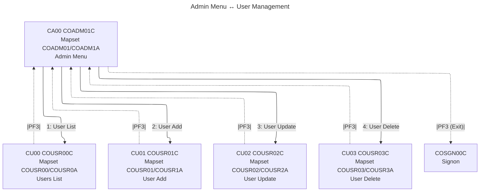

# COADM01 — Admin Menu

- __Transaction ID__: CA00 (from `WS-TRANID` in `app/cbl/COADM01C.cbl`)
- __Program__: `COADM01C`
- __BMS Mapset/Map__: `COADM01` / `COADM1A`
- __Datasets__: Not specifically evidenced here.
- __PF-Keys__:
  - ENTER: Parses 2-digit `OPTION` (1..4) and XCTLs to the mapped program per `app/cpy/COADM02Y.cpy`.
  - PF3: Exit to Signon — XCTL `COSGN00C`.

## UI elements (extracted from `app/bms/COADM01.bms`)

- __Static labels__:
  - "Tran:" at (1,1) — blue
  - "Date:" at (1,65) — blue
  - "Prog:" at (2,1) — blue
  - "Time:" at (2,65) — blue
  - "Admin Menu" at (4,35) — neutral, bright
  - "Please select an option :" at (20,15) — turquoise, bright
  - Footer "ENTER=Continue  F3=Exit" at (24,1) — yellow

- __Fields__:
  - `TRNNAME` length 4 at (1,7) — blue, ASKIP FSET
  - `TITLE01` length 40 at (1,21) — yellow, ASKIP FSET
  - `CURDATE` length 8 at (1,71) — blue, ASKIP FSET, init 'mm/dd/yy'
  - `PGMNAME` length 8 at (2,7) — blue, ASKIP FSET
  - `TITLE02` length 40 at (2,21) — yellow, ASKIP FSET
  - `CURTIME` length 8 at (2,71) — blue, ASKIP FSET, init 'hh:mm:ss'
  - `OPTN001`..`OPTN012` each length 40 at rows 6..17, column 20 — blue, ASKIP FSET
  - `OPTION` length 2 at (20,41) — UNPROT, NUM, IC, underline, RIGHT/ZERO justify (input field)
  - (unnamed) length 0 at (20,44) — green, ASKIP NORM (spacer)
  - `ERRMSG` length 78 at (23,1) — red, bright, FSET (message area)

- __Notes__:
  - Mapset header: CTRL(ALARM, FREEKB), EXTATT=YES, TIOAPFX=YES, STORAGE=AUTO, MODE=INOUT, LANG=COBOL

## Navigation flow (Admin Menu ↔ User Management)

* __Sources__
  - Options → `app/cpy/COADM02Y.cpy` maps 1..4 to `COUSR00C`..`COUSR03C`.
  - Transactions → `WS-TRANID` in `app/cbl/COADM01C.cbl` (CA00), `COUSR00C.cbl` (CU00), `COUSR01C.cbl` (CU01), `COUSR02C.cbl` (CU02), `COUSR03C.cbl` (CU03).
  - PF3 → In `app/cbl/COADM01C.cbl` PF3 → `COSGN00C` (signon). In `COUSR00C/01C/02C/03C.cbl` PF3 → `COADM01C`.

