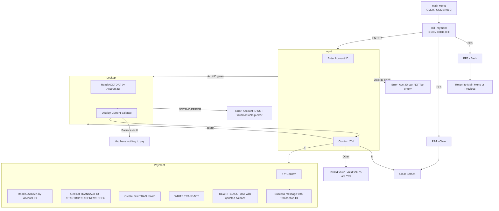

# Bill Payment — Pay Balance in Full (User)

- Transaction: `CB00`
- Program: `COBIL00C`
- Mapset: `COBIL00`
- Map: `COBIL0A`

## Summary
This screen lets a user pay the full outstanding account balance. User enters an Account ID, the program retrieves the current balance, and upon confirmation (Y), creates a new transaction and updates the account balance to reflect the payment.

Key behaviors:
- On first entry, if `CDEMO-CB00-TRN-SELECTED` is present (from a previous screen), the program pre-fills `ACTIDIN` and proceeds as if ENTER was pressed.
- PF3 returns to the previous program (`CDEMO-FROM-PROGRAM`) or Main Menu (`COMEN01C`) if none.
- PF4 clears the screen.

## Diagrams
Application Flow (Mermaid)

## Program, Map, and Transaction
- Transaction ID: `CB00` (`WS-TRANID`)
- Program: `COBIL00C` (`WS-PGMNAME`)
- Mapset: `COBIL00`
- Map: `COBIL0A`

## Dataset Operations (CICS)
- ACCTDAT (Account master)
  - `READ ... UPDATE` by `ACCT-ID` in `READ-ACCTDAT-FILE`
  - `REWRITE` updated balance in `UPDATE-ACCTDAT-FILE`
- CXACAIX (Account→Card xref)
  - `READ` by `XREF-ACCT-ID` in `READ-CXACAIX-FILE`
- TRANSACT (Transaction file)
  - Allocate new `TRAN-ID` via `STARTBR` + `READPREV` + `ENDBR`
  - Write new transaction with `WRITE-TRANSACT-FILE`

## PF-key Handling
- ENTER: `PROCESS-ENTER-KEY`
  - Validates `ACTIDIN`
  - Reads account, displays current balance
  - Interprets `CONFIRM` (Y/N/blank/other)
  - On Y, posts bill payment transaction and updates account balance
- PF3: Return to previous (`CDEMO-FROM-PROGRAM`) or `COMEN01C` if none; `RETURN-TO-PREV-SCREEN`
- PF4: Clear fields; `CLEAR-CURRENT-SCREEN`
- Other: Error `CCDA-MSG-INVALID-KEY`

## Behavior and Flow
- Initial entry
  - `EIBCALEN = 0` → go to Sign-on `COSGN00C` (safety)
  - Else, on first-show set cursor to `ACTIDIN`. If `CDEMO-CB00-TRN-SELECTED` is set, prefill and process ENTER.
- ENTER processing (`PROCESS-ENTER-KEY`)
  - If `ACTIDIN` empty → error and cursor to `ACTIDIN`
  - Move `ACTIDIN` to `ACCT-ID` and `XREF-ACCT-ID`
  - CONFIRM handling:
    - `Y`/`y` → `CONF-PAY-YES`, proceed with account read and payment
    - `N`/`n` → clear screen; message state flagged
    - Spaces/low-values → read account only (show balance)
    - Other → error and cursor to `CONFIRM`
  - After account read, show `ACCT-CURR-BAL` in `CURBAL`
  - If balance <= 0 → error "You have nothing to pay..."
  - If confirmed YES and no errors:
    - Read `CXACAIX`
    - Get next `TRAN-ID` (READPREV of `TRANSACT`)
    - Fill transaction:
      - `TRAN-TYPE-CD = '02'`, `TRAN-CAT-CD = 2`
      - `TRAN-SOURCE = 'POS TERM'`
      - `TRAN-DESC = 'BILL PAYMENT - ONLINE'`
      - `TRAN-AMT = ACCT-CURR-BAL`
      - Merchant: ID `999999999`, Name `BILL PAYMENT`, City `N/A`, Zip `N/A`
      - Timestamps via `ASKTIME` + `FORMATTIME`
    - `WRITE TRANSACT`, then `REWRITE ACCTDAT` with reduced balance
    - On success, initialize fields and show green success message with new Transaction ID

## UI Elements (from `app/bms/COBIL00.bms`)
- Header
  - `TRNNAME` (blue) at (1,7), shows `CB00`
  - `PGMNAME` (blue) at (2,7), shows `COBIL00C`
  - `CURDATE`/`CURTIME` (blue) at (1,71)/(2,71)
  - `TITLE01`/`TITLE02` (yellow) titles
- Body
  - Title: "Bill Payment" centered at (4,35), bright neutral
  - Label: "Enter Acct ID:" (green) at (6,6)
  - Input: `ACTIDIN` length 11, green, underline, unprotected at (6,21)
  - Separator line at (8,6)
  - Label: "Your current balance is:" (turquoise) at (11,6)
  - Field: `CURBAL` length 14 at (11,32)
  - Prompt: "Do you want to pay your balance now. Please confirm:" (turquoise) at (15,6)
  - Input: `CONFIRM` length 1, green, underline, unprotected at (15,60) with literal `(Y/N)` at (15,63)
- Messages
  - `ERRMSG` bright red at (23,1) for errors/success
- Footer keys
  - Literal at (24,1): `ENTER=Continue  F3=Back  F4=Clear`

## Key Paragraphs (from `app/cbl/COBIL00C.cbl`)
- `MAIN-PARA`
- `PROCESS-ENTER-KEY`
- `SEND-BILLPAY-SCREEN`
- `RECEIVE-BILLPAY-SCREEN`
- `READ-ACCTDAT-FILE` / `UPDATE-ACCTDAT-FILE`
- `READ-CXACAIX-FILE`
- `STARTBR-TRANSACT-FILE` / `READPREV-TRANSACT-FILE` / `ENDBR-TRANSACT-FILE`
- `WRITE-TRANSACT-FILE`
- `CLEAR-CURRENT-SCREEN` / `INITIALIZE-ALL-FIELDS`
- `RETURN-TO-PREV-SCREEN`

## Notable Messages
- "Acct ID can NOT be empty..."
- "Account ID NOT found..."
- "Unable to lookup Account..."
- "Unable to Update Account..."
- "Unable to lookup XREF AIX file..."
- "Transaction ID NOT found..." (on STARTBR errors)
- "Unable to lookup Transaction..."
- "You have nothing to pay..."
- "Confirm to make a bill payment..."
- "Invalid value. Valid values are (Y/N)..."
- Success (green): "Payment successful. Your Transaction ID is <id>."
- Invalid PF-key: copybook `CCDA-MSG-INVALID-KEY`

## Related Screens
- Transaction List: [COTRN00.md](./COTRN00.md)
- Transaction View: [COTRN01.md](./COTRN01.md)
- Transaction Add: [COTRN02.md](./COTRN02.md)
- Main Menu: [COMEN01.md](./COMEN01.md)
