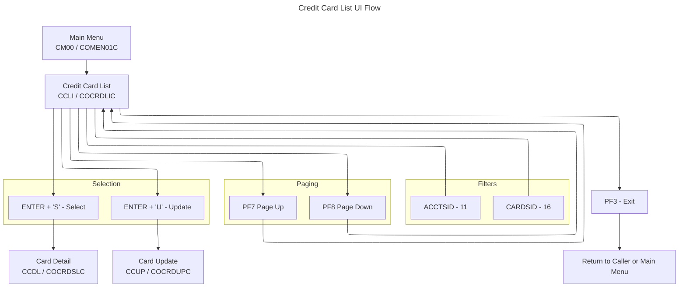

# Credit Card List UI Flow (COCRDLIC / COCRDLI)

This document summarizes the Credit Card List flow and UI, derived from COBOL program `app/cbl/COCRDLIC.cbl` and BMS map `app/bms/COCRDLI.bms`.

## Summary
- Lists credit cards with optional filters by Account ID and Card Number.
- 7 rows per page with paging via PF7 (back) and PF8 (forward).
- On ENTER, allows one-row selection:
  - Type `S` = view details (navigates to detail screen).
  - Type `U` = update (navigates to update screen).
- Screen itself is read-only; no dataset updates are performed here.

## Diagrams
Application Flow (Mermaid)

## Transaction, Program, Mapset/Map
- Transaction: `CCLI` (`LIT-THISTRANID`)
- Program: `COCRDLIC` (`LIT-THISPGM`)
- Mapset: `COCRDLI` (`LIT-THISMAPSET`)
- Map: `CCRDLIA` (`LIT-THISMAP`)

## Datasets and Operations
- Primary file: `CARDDAT` (`LIT-CARD-FILE`)
  - Browse with `EXEC CICS STARTBR/READNEXT/READPREV/ENDBR` using key `WS-CARD-RID-CARDNUM` (card number path).
- Alt index constant present: `CARDAIX` (`LIT-CARD-FILE-ACCT-PATH`) but not used directly in this program.
- Filtering is done in code after each read in `9500-FILTER-RECORDS` against the provided Account ID and/or Card Number.

## PF-Key Handling
- Valid AIDs: `ENTER`, `PF3`, `PF7`, `PF8`. Others are coerced to `ENTER` (`PFK-INVALID` → set `CCARD-AID-ENTER`).
- `PF3`: Exit via `EXEC CICS XCTL` to caller or Main Menu (`COMEN01C`). Sets `WS-EXIT-MESSAGE` ("PF03 PRESSED.EXITING").
- `PF7`: Page up via `9100-READ-BACKWARDS`. If already at first page, error: "NO PREVIOUS PAGES TO DISPLAY".
- `PF8`: Page down via `9000-READ-FORWARD`.
  - If next page exists: show info "TYPE S FOR DETAIL, U TO UPDATE ANY RECORD".
  - If at end: "NO MORE PAGES TO DISPLAY" or "NO MORE RECORDS TO SHOW" depending on browse state.
- Footer (BMS `FKEYS` static): `F3=Exit F7=Backward  F8=Forward`.

## Behavior and Flow
- Entry context and initialization:
  - Fresh start (`EIBCALEN=0`): initialize context, set `CA-FIRST-PAGE` and `CA-LAST-PAGE-NOT-SHOWN`, default to first page.
  - Re-enter from this program: `2000-RECEIVE-MAP` then `2200-EDIT-INPUTS`.
- Input fields and edit (`2200-EDIT-INPUTS`):
  - `2210-EDIT-ACCOUNT`: If supplied, must be 11-digit numeric; else error and protect selection rows. Error text: "ACCOUNT FILTER,IF SUPPLIED MUST BE A 11 DIGIT NUMBER".
  - `2220-EDIT-CARD`: If supplied, must be 16-digit numeric; else error and protect selection rows. Error text: "CARD ID FILTER,IF SUPPLIED MUST BE A 16 DIGIT NUMBER".
  - `2250-EDIT-ARRAY`: Validate the 7 selection codes. Only one of `S` or `U` allowed across rows. Error text: "PLEASE SELECT ONLY ONE RECORD TO VIEW OR UPDATE". Invalid codes → "INVALID ACTION CODE" and mark offending row(s).
- Paging and list population:
  - Forward (`9000-READ-FORWARD`): STARTBR on `CARDDAT`, READNEXT until 7 displayable records or ENDFILE.
    - Sets `WS-CA-FIRST-CARD-ACCT-ID/NUM` (top row) and `WS-CA-LAST-CARD-ACCT-ID/NUM` (for paging).
    - On ENDFILE of page-fill lookahead: set `CA-NEXT-PAGE-NOT-EXISTS` and optionally error "NO MORE RECORDS TO SHOW".
  - Backward (`9100-READ-BACKWARDS`): position using `WS-CA-FIRST-CARDKEY`, READPREV to fill previous 7 records and set new first key.
- Messaging (`1400-SETUP-MESSAGE`):
  - PF7 at first page → error "NO PREVIOUS PAGES TO DISPLAY".
  - PF8 with no next page → error "NO MORE PAGES TO DISPLAY"; if last page not yet flagged, set info message instead.
  - Default info (when applicable): "TYPE S FOR DETAIL, U TO UPDATE ANY RECORD".
  - No results on page 1 → `WS-NO-RECORDS-FOUND` ("NO RECORDS FOUND FOR THIS SEARCH CONDITION.").
- Send/Receive:
  - `2100-RECEIVE-SCREEN`: reads `CCRDLIAI` and moves filters and selection flags to working storage.
  - `1500-SEND-SCREEN`: `EXEC CICS SEND MAP(CCRDLIA) MAPSET(COCRDLI) FROM(CCRDLIAO) CURSOR ERASE FREEKB`.
- Cursor and attributes:
  - Filter errors: set field color to red, position cursor to the first invalid filter field.
  - Selection errors: mark offending rows; set selection cell color red and position cursor on the first bad row.
  - When input errors exist, selection cells are protected for all rows.

## Navigation
- From Main Menu: `COMEN01C` (`CM00`) → this screen (`COCRDLIC`/`CCLI`).
- To Card Detail (view): `COCRDSLC` (`CCDL`), mapset `COCRDSL`, map `CCRDSLA`.
- To Card Update (update): `COCRDUPC` (`CCUP`), mapset `COCRDUP`, map `CCRDUPA`.
- Exit (`PF3`): `XCTL` to caller or Main Menu (`COMEN01C`).

## UI Elements (extracted from BMS `app/bms/COCRDLI.bms`)
- Header:
  - `TRNNAME` length 4, ASKIP FSET BLUE at (1,7)
  - `PGMNAME` length 8, ASKIP BLUE at (2,7)
  - `TITLE01` length 40 YELLOW at (1,21)
  - `TITLE02` length 40 YELLOW at (2,21)
  - `CURDATE` length 8 BLUE at (1,71), initial `mm/dd/yy`
  - `CURTIME` length 8 BLUE at (2,71), initial `hh:mm:ss`
- Title and page:
  - Literal "List Credit Cards" at (4,31)
  - Literal "Page " at (4,70) and `PAGENO` length 3 at (4,76)
- Filters:
  - Prompt "Account Number    :" TURQUOISE at (6,22)
  - `ACCTSID` length 11, UNPROT, GREEN, UNDERLINE, FSET, IC at (6,44)
  - Prompt "Credit Card Number:" TURQUOISE at (7,22)
  - `CARDSID` length 16, UNPROT, GREEN, UNDERLINE, FSET at (7,44)
- Column headers and separators:
  - "Select" at (9,10)
  - "Account Number" at (9,21)
  - " Card Number " at (9,45)
  - "Active " at (9,66)
  - Separator dashes at row 10
- Row fields (7 rows): for i=1..7
  - `CRDSELi` length 1, PROT, UNDERLINE at row 10+i, col 12
  - `ACCTNOi` length 11, PROT at row 10+i, col 22
  - `CRDNUMi` length 16, PROT at row 10+i, col 43
  - `CRDSTSi` length 1, PROT at row 10+i, col 67
  - Note: map includes `CRDSTPi` dark filler at col 14 for rows 2..7.
  - Note: while BMS defines `CRDSELi` as PROT, program toggles attributes at runtime to unprotect error-free rows and highlights invalid ones in red.
- Messages:
  - `INFOMSG` length 45, PROT, NEUTRAL at (20,19)
  - `ERRMSG` length 78, BRT, RED, FSET at (23,1)
- Footer:
  - Static at (24,1): `F3=Exit F7=Backward  F8=Forward`

## Key Paragraph References
- PF gating and dispatch: `0000-MAIN` (AID validation and routing)
- Receive and input edits: `2000-RECEIVE-MAP` → `2100-RECEIVE-SCREEN` → `2200-EDIT-INPUTS` → `2210-EDIT-ACCOUNT`, `2220-EDIT-CARD`, `2250-EDIT-ARRAY`
- Message setup: `1400-SETUP-MESSAGE`
- Send map: `1500-SEND-SCREEN`
- Browse forward/back: `9000-READ-FORWARD`, `9100-READ-BACKWARDS`, filter: `9500-FILTER-RECORDS`
- Transfers: `EXEC CICS XCTL` to detail/update/menu in the ENTER/PF3 branches

## Notable Messages (built in code)
- "TYPE S FOR DETAIL, U TO UPDATE ANY RECORD"
- "NO PREVIOUS PAGES TO DISPLAY"
- "NO MORE PAGES TO DISPLAY"
- "NO MORE RECORDS TO SHOW"
- "ACCOUNT FILTER,IF SUPPLIED MUST BE A 11 DIGIT NUMBER"
- "CARD ID FILTER,IF SUPPLIED MUST BE A 16 DIGIT NUMBER"
- "PLEASE SELECT ONLY ONE RECORD TO VIEW OR UPDATE"
- "INVALID ACTION CODE"
- "NO RECORDS FOUND FOR THIS SEARCH CONDITION."
- "PF03 PRESSED.EXITING"

## Notes
- Selection array accepts only one action across all rows. Multiple actions mark each offending `CRDSEL` cell and display the corresponding error.
- When filter input errors are present, all selection cells are protected to force correction first.
- Cursor is positioned on the first invalid field (filter or selection) using `...L` length set to `-1` in the map input structure.
