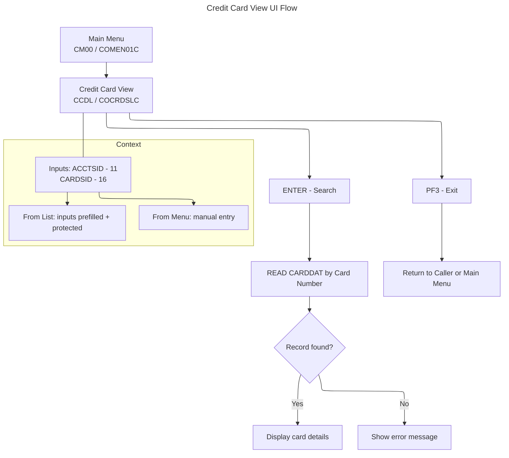

# Credit Card View UI Flow (COCRDSLC / COCRDSL)

This document summarizes the Credit Card View flow and UI, derived from COBOL program `app/cbl/COCRDSLC.cbl` and BMS map `app/bms/COCRDSL.bms`.

## Summary
- Displays credit card details by Account ID and Card Number.
- Read-only flow: no updates. Reads the `CARDDAT` VSAM file (and optionally `CARDAIX` alt index function exists but is not invoked here).
- Entry contexts: from Main Menu (manual input) or from Credit Card List (pre-populated, protected inputs).

## Diagrams
Application Flow (Mermaid)

## Transaction, Program, Mapset/Map
- Transaction: `CCDL` (`LIT-THISTRANID`)
- Program: `COCRDSLC` (`LIT-THISPGM`)
- Mapset: `COCRDSL` (`LIT-THISMAPSET`)
- Map: `CCRDSLA` (`LIT-THISMAP`)

## Datasets and Operations
- `CARDDAT` (primary): EXEC CICS READ by Card Number in `9100-GETCARD-BYACCTCARD`.
  - `EXEC CICS READ FILE(LIT-CARDFILENAME) RIDFLD(WS-CARD-RID-CARDNUM) INTO(CARD-RECORD)`
- `CARDAIX` (alternate index by Account ID): `9150-GETCARD-BYACCT` exists to READ via `LIT-CARDFILENAME-ACCT-PATH`, but this paragraph is not called in this program’s main flow.
- No READ UPDATE or REWRITE. No SYNCPOINT/ROLLBACK logic; this screen is display-only.

## PF-Key Handling
- Allowed AIDs are gated early in `0000-MAIN`:
  - Valid: `ENTER`, `PF3`. Anything else is coerced to `ENTER` by setting `CCARD-AID-ENTER` when `PFK-INVALID`.
  - `PF3`: exit by `EXEC CICS XCTL` to caller (if available) or Main Menu (`COMEN01C`).
  - `ENTER`: initial display or process inputs to perform search and then display results.
- Footer (BMS `FKEYS`): static text `ENTER=Search Cards  F3=Exit` (`COCRDSL.bms` `FKEYS` field). No dynamic brightening for footer keys in this screen.

## Behavior and Flow
- Entry contexts evaluated in `0000-MAIN`:
  - From Credit Card List: `WHEN CDEMO-PGM-ENTER AND CDEMO-FROM-PROGRAM = LIT-CCLISTPGM`
    - Copies `CDEMO-ACCT-ID` and `CDEMO-CARD-NUM` into working fields.
    - `PERFORM 9000-READ-DATA` → `PERFORM 1000-SEND-MAP` → return.
  - From other contexts (e.g., Main Menu): `WHEN CDEMO-PGM-ENTER`
    - `1000-SEND-MAP` to show input fields, return and wait for user input.
  - Re-enter (`CDEMO-PGM-REENTER`):
    - `2000-PROCESS-INPUTS` → if errors, `1000-SEND-MAP`; else `9000-READ-DATA` then `1000-SEND-MAP`.
  - `PF3`: XCTL to caller or `COMEN01C`.

- Input receive and edit:
  - `2100-RECEIVE-MAP` reads `CCRDSLAI`.
  - `2200-EDIT-MAP-INPUTS` performs:
    - Normalize inputs: replace `*` or spaces with LOW-VALUES for `ACCTSIDI` and `CARDSIDI`.
    - `2210-EDIT-ACCOUNT`: requires 11-digit numeric; sets messages on error.
    - `2220-EDIT-CARD`: requires 16-digit numeric; sets messages on error.
    - Cross-field: if both blank → `NO-SEARCH-CRITERIA-RECEIVED`.

- Data retrieval and messaging:
  - `9000-READ-DATA` → `9100-GETCARD-BYACCTCARD` READs `CARDDAT` by card number.
    - On `DFHRESP(NORMAL)`: sets `FOUND-CARDS-FOR-ACCOUNT`.
    - On `DFHRESP(NOTFND)`: sets input error, flags both filters not OK, message `DID-NOT-FIND-ACCTCARD-COMBO`.
    - On other RESP: builds `WS-FILE-ERROR-MESSAGE` with op `READ` on `CARDDAT`.

- Screen setup and send:
  - `1100-SCREEN-INIT`: clears map, sets titles, date/time, program and tran names.
  - `1200-SETUP-SCREEN-VARS`:
    - If coming fresh (`EIBCALEN = 0`): sets `WS-PROMPT-FOR-INPUT`.
    - If `FOUND-CARDS-FOR-ACCOUNT`: moves details to output fields (`CRDNAMEO`, `EXPMONO`, `EXPYEARO`, `CRDSTCDO`).
    - Moves `WS-RETURN-MSG` to `ERRMSGO`, `WS-INFO-MSG` to `INFOMSGO`.
  - `1300-SETUP-SCREEN-ATTRS`:
    - Protects inputs when arriving from list (`MOVE DFHBMPRF TO ACCTSIDA/CARDSIDA`), else unprotects (`DFHBMFSE`).
    - Positions cursor to the first invalid/blank filter.
    - Colors: default color on pre-populated list context; error fields set to `DFHRED`.
  - `1400-SEND-SCREEN`: `EXEC CICS SEND MAP(CCARD-NEXT-MAP) MAPSET(CCARD-NEXT-MAPSET) ... CURSOR ERASE FREEKB`, sets `CDEMO-PGM-REENTER` for round-trip.

## Navigation
- From Main Menu: Option “Credit Card View” triggers program `COCRDSLC` and transaction `CCDL`.
- From Credit Card List (`COCRDLIC`): selection passes `ACCT-ID`/`CARD-NUM` in commarea; inputs are protected and details are displayed.
- Exit via `PF3` returns control by `XCTL` to caller or Main Menu (`COMEN01C`).

## UI Elements (extracted from BMS `app/bms/COCRDSL.bms`)
- Header: `TRNNAME`, `PGMNAME`, `TITLE01`, `TITLE02`, `CURDATE`, `CURTIME`.
- Prompts and inputs:
  - `ACCTSID` length 11, UNPROT (protected when from list), underlined.
  - `CARDSID` length 16, UNPROT (protected when from list), underlined.
- Output fields:
  - `CRDNAME` length 50 (Name on card).
  - `CRDSTCD` length 1 (Active Y/N), ASKIP.
  - `EXPMON` length 2 and `EXPYEAR` length 4 (Expiry).
- Messages:
  - `INFOMSG` neutral, protected.
  - `ERRMSG` bright red, FSET.
- Footer keys:
  - `FKEYS` initial: `ENTER=Search Cards  F3=Exit`.

## Key Paragraph References
- PF-key gating and dispatch: `0000-MAIN`.
- Send path: `1000-SEND-MAP` → `1100/1200/1300/1400`.
- Receive and edits: `2000-PROCESS-INPUTS` → `2100`, `2200`, `2210`, `2220`.
- Data read: `9000-READ-DATA` → `9100-GETCARD-BYACCTCARD` (primary). `9150-GETCARD-BYACCT` present but not invoked.
- Exit: `EXEC CICS XCTL` in PF3 branch.

## Notes
- This screen is strictly display-only; there are no updates or commits.
- Inputs are protected when arriving from the list screen to prevent accidental edits; otherwise inputs are editable for ad-hoc search.
