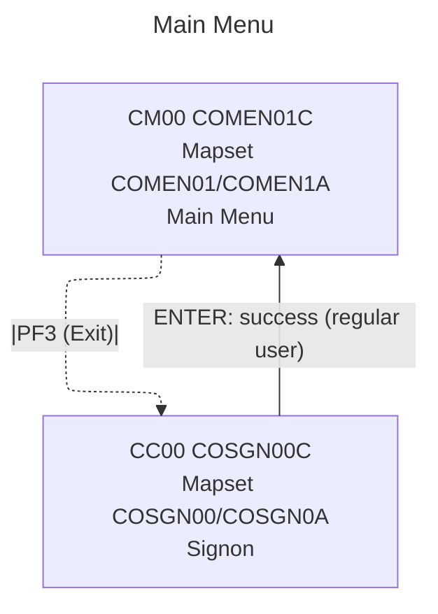

# COMEN01 — Main Menu

- __Transaction ID__: CM00 (from `WS-TRANID` in `app/cbl/COMEN01C.cbl`)
- __Program__: `COMEN01C`
- __BMS Mapset/Map__: `COMEN01` / `COMEN1A`
- __Datasets__: `USRSEC` (declared), general menu logic uses COMMAREA and copybook `COMEN02Y` for options
- __PF-Keys__:
  - ENTER: Parses 2-digit `OPTION`, validates against `CDEMO-MENU-OPT-COUNT` and access (`CDEMO-MENU-OPT-USRTYPE`), then XCTL to target `CDEMO-MENU-OPT-PGMNAME(WS-OPTION)`.
  - PF3: Exit to Signon — sets `CDEMO-TO-PROGRAM` to `COSGN00C` and XCTL via `RETURN-TO-SIGNON-SCREEN`.

## Navigation flow (Signon ↔ Main Menu)

* __Sources__
  - `app/cbl/COSGN00C.cbl` — `WS-TRANID='CC00'`, on successful signon routes to `COMEN01C` for regular users.
  - `app/cbl/COMEN01C.cbl` — `WS-TRANID='CM00'`, PF3 → `COSGN00C`.
  - `app/bms/COSGN00.bms`, `app/bms/COMEN01.bms` — mapsets, maps, footer prompts.

## Main Menu options (from `app/cpy/COMEN02Y.cpy`)

1. Account View → `COACTVWC` (user)
2. Account Update → `COACTUPC` (user)
3. Credit Card List → `COCRDLIC` (user)
4. Credit Card View → `COCRDSLC` (user)
5. Credit Card Update → `COCRDUPC` (user)
6. Transaction List → `COTRN00C` (user)
7. Transaction View → `COTRN01C` (user)
8. Transaction Add → `COTRN02C` (user)
9. Transaction Reports → `CORPT00C` (user)
10. Bill Payment → `COBIL00C` (user)

Notes:
- Access control uses `CDEMO-MENU-OPT-USRTYPE`; if an entry is marked 'A' and the current user type is USER, PF error message is shown and no XCTL.

## UI elements (extracted from `app/bms/COMEN01.bms`)

- __Static labels__:
  - "Tran:" at (1,1) — blue
  - "Date:" at (1,65) — blue
  - "Prog:" at (2,1) — blue
  - "Time:" at (2,65) — blue
  - "Main Menu" at (4,35) — neutral, bright
  - "Please select an option :" at (20,15) — turquoise, bright
  - Footer "ENTER=Continue  F3=Exit" at (24,1) — yellow

- __Fields__:
  - `TRNNAME` length 4 at (1,7) — blue, ASKIP FSET
  - `TITLE01` length 40 at (1,21) — yellow, ASKIP FSET
  - `CURDATE` length 8 at (1,71) — blue, ASKIP FSET, init 'mm/dd/yy'
  - `PGMNAME` length 8 at (2,7) — blue, ASKIP FSET
  - `TITLE02` length 40 at (2,21) — yellow, ASKIP FSET
  - `CURTIME` length 8 at (2,71) — blue, ASKIP FSET, init 'hh:mm:ss'
  - `OPTN001`..`OPTN012` each length 40 at rows 6..17, column 20 — blue, ASKIP FSET
  - `OPTION` length 2 at (20,41) — UNPROT, NUM, IC, underline, RIGHT/ZERO justify (input field)
  - (unnamed) length 0 at (20,44) — green, ASKIP NORM (spacer)
  - `ERRMSG` length 78 at (23,1) — red, bright, FSET (message area)

## Notes
- Mapset header: CTRL(ALARM, FREEKB), EXTATT=YES, TIOAPFX=YES, STORAGE=AUTO, MODE=INOUT, LANG=COBOL
