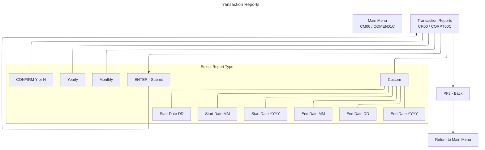

# Transaction Reports UI Flow (CORPT00C / CORPT00)

This document summarizes the Transaction Reports flow and UI, derived from COBOL program `app/cbl/CORPT00C.cbl` and BMS map `app/bms/CORPT00.bms`.

## Summary
- Submit printing of transaction reports from online CICS via an extra-partition TDQ (`JOBS`).
- Report types:
  - Monthly: current month
  - Yearly: current year
  - Custom: user-provided start and end dates
- ENTER validates selection and dates (for Custom), prompts for confirmation, then submits JCL to INTRDR.
- PF3 returns to Main Menu.

## Diagrams
Application Flow (Mermaid)

## Transaction, Program, Mapset/Map
- Transaction: `CR00` (`WS-TRANID`)
- Program: `CORPT00C` (`WS-PGMNAME`)
- Mapset: `CORPT00`
- Map: `CORPT0A`

## Datasets and Operations
- Job submission via CICS TDQ:
  - `EXEC CICS WRITEQ TD QUEUE('JOBS') FROM(JCL-RECORD) LENGTH(...)` in `WIRTE-JOBSUB-TDQ`.
  - Loops over prepared `JOB-DATA` JCL lines until `/*EOF` and writes each line.
- Date validation utility:
  - `CALL 'CSUTLDTC'` for `WS-START-DATE` and `WS-END-DATE` with format `YYYY-MM-DD`.
- No direct file I/O to `TRANSACT` on this screen.

## PF-Key Handling
- In `MAIN-PARA` after `RECEIVE-TRNRPT-SCREEN`:
  - `ENTER`: `PROCESS-ENTER-KEY` (select report type, validate inputs, confirm, then submit)
  - `PF3`: set `CDEMO-TO-PROGRAM` to `COMEN01C` and `RETURN-TO-PREV-SCREEN`
  - Other: error message `CCDA-MSG-INVALID-KEY`, cursor to `MONTHLY`
- Footer (BMS static): `ENTER=Continue  F3=Back`

## Behavior and Flow
- Entry and initialization:
  - Fresh start (`EIBCALEN = 0`): send user to sign-on (`COSGN00C`).
  - First entry: set `CDEMO-PGM-REENTER`, initialize map to `LOW-VALUES`, cursor to `MONTHLY`.
  - Subsequent entries: receive map and dispatch on AID.
- ENTER processing (`PROCESS-ENTER-KEY`):
  - If `MONTHLY` selected: compute start as first day of current month; end as last day of current month; set parms; `SUBMIT-JOB-TO-INTRDR`.
  - If `YEARLY` selected: start `YYYY-01-01`; end `YYYY-12-31` for current year; set parms; `SUBMIT-JOB-TO-INTRDR`.
  - If `CUSTOM` selected:
    - Validate each component for empty and numeric ranges: `MM<=12`, `DD<=31`, `YYYY` numeric.
    - Build `WS-START-DATE` and `WS-END-DATE` in `YYYY-MM-DD`.
    - Validate dates with `CSUTLDTC`; allow only message 2513 as acceptable non-zero severity; otherwise error and cursor to offending field.
    - On success: set parms and `SUBMIT-JOB-TO-INTRDR`.
  - Else: message "Select a report type to print report..." and cursor to `MONTHLY`.
- Confirmation and submission (`SUBMIT-JOB-TO-INTRDR`):
  - If `CONFIRM` blank/low: prompt "Please confirm to print the <Report> report..." and cursor to `CONFIRM`.
  - If `CONFIRM = 'Y'/'y'`: proceed; iterate `JOB-LINES` and `WRITEQ TD` to `JOBS`.
  - If `CONFIRM = 'N'/'n'`: re-initialize fields and re-display.
  - Otherwise: show `"<char>" is not a valid value to confirm...` and cursor to `CONFIRM`.
- Success path:
  - `INITIALIZE-ALL-FIELDS`, set `ERRMSGC` to `DFHGREEN`, message `"<Report> report submitted for printing ..."`, and send screen.

## Navigation
- From Main Menu: `COMEN01C` (`CM00`) → this screen (`CORPT00C`/`CR00`).
- Exit (`PF3`): `XCTL` to Main Menu (`COMEN01C`).

## UI Elements (extracted from BMS `app/bms/CORPT00.bms`)
- Header:
  - Literal "Tran:" at (1,1)
  - `TRNNAME` length 4, ASKIP FSET BLUE at (1,7)
  - `TITLE01` length 40, ASKIP FSET YELLOW at (1,21)
  - Literal "Date:" at (1,65)
  - `CURDATE` length 8, ASKIP FSET BLUE at (1,71), initial `mm/dd/yy`
  - Literal "Prog:" at (2,1)
  - `PGMNAME` length 8, ASKIP FSET BLUE at (2,7)
  - `TITLE02` length 40, ASKIP FSET YELLOW at (2,21)
  - Literal "Time:" at (2,65)
  - `CURTIME` length 8, ASKIP FSET BLUE at (2,71), initial `hh:mm:ss`
- Title and options:
  - Literal "Transaction Reports" BRT NEUTRAL at (4,30)
  - `MONTHLY` length 1, UNPROT, GREEN, UNDERLINE, FSET, IC at (7,10) with label TURQUOISE at (7,15) "Monthly (Current Month)"
  - `YEARLY` length 1, UNPROT, GREEN, UNDERLINE, FSET at (9,10) with label TURQUOISE at (9,15) "Yearly (Current Year)"
  - `CUSTOM` length 1, UNPROT, GREEN, UNDERLINE, FSET at (11,10) with label TURQUOISE at (11,15) "Custom (Date Range)"
- Custom date inputs:
  - Label TURQUOISE "Start Date :" at (13,15)
  - `SDTMM` 2 NUM UNPROT GREEN UNDERLINE at (13,29); literal '/' at (13,32)
  - `SDTDD` 2 NUM UNPROT GREEN UNDERLINE at (13,34); literal '/' at (13,37)
  - `SDTYYYY` 4 NUM UNPROT GREEN UNDERLINE at (13,39); hint BLUE "(MM/DD/YYYY)" at (13,46)
  - Label TURQUOISE "  End Date :" at (14,15)
  - `EDTMM` 2 NUM UNPROT GREEN UNDERLINE at (14,29); '/' at (14,32)
  - `EDTDD` 2 NUM UNPROT GREEN UNDERLINE at (14,34); '/' at (14,37)
  - `EDTYYYY` 4 NUM UNPROT GREEN UNDERLINE at (14,39); hint BLUE "(MM/DD/YYYY)" at (14,46)
- Confirmation and messages:
  - Literal TURQUOISE "The Report will be submitted for printing. Please confirm:" spans (19,6) length 59
  - `CONFIRM` length 1, UNPROT, GREEN, UNDERLINE at (19,66) with literal NEUTRAL "(Y/N)" at (19,69)
  - `ERRMSG` length 78, BRT, RED, FSET at (23,1)
- Footer:
  - Static at (24,1): `ENTER=Continue  F3=Back`

## Key Paragraph References (in `app/cbl/CORPT00C.cbl`)
- `MAIN-PARA` (program entry, AID dispatch)
- `PROCESS-ENTER-KEY` (selection, date validation, and submit)
- `SUBMIT-JOB-TO-INTRDR` (confirmation and job write loop)
- `WIRTE-JOBSUB-TDQ` (TDQ WRITE and RESP handling)
- `SEND-TRNRPT-SCREEN` and `RECEIVE-TRNRPT-SCREEN` (map I/O)
- `POPULATE-HEADER-INFO` (header fields and date/time)
- `INITIALIZE-ALL-FIELDS`
- `RETURN-TO-PREV-SCREEN` (XCTL transfer)

## Notable Messages (from code)
- "Select a report type to print report..."
- "Start Date - Month can NOT be empty..."
- "Start Date - Day can NOT be empty..."
- "Start Date - Year can NOT be empty..."
- "End Date - Month can NOT be empty..."
- "End Date - Day can NOT be empty..."
- "End Date - Year can NOT be empty..."
- "Start Date - Not a valid Month..."
- "Start Date - Not a valid Day..."
- "Start Date - Not a valid Year..."
- "End Date - Not a valid Month..."
- "End Date - Not a valid Day..."
- "End Date - Not a valid Year..."
- "Start Date - Not a valid date..." (from CSUTLDTC)
- "End Date - Not a valid date..." (from CSUTLDTC)
- "Please confirm to print the <Report> report..."
- '"<char>" is not a valid value to confirm...'
- "Unable to Write TDQ (JOBS)..."
- Success: "<Report> report submitted for printing ..."

## Related Screens
- Transaction List: [COTRN00.md](./COTRN00.md)
- Transaction View: [COTRN01.md](./COTRN01.md)
- Transaction Add: [COTRN02.md](./COTRN02.md)
- Main Menu: [COMEN01.md](./COMEN01.md)
