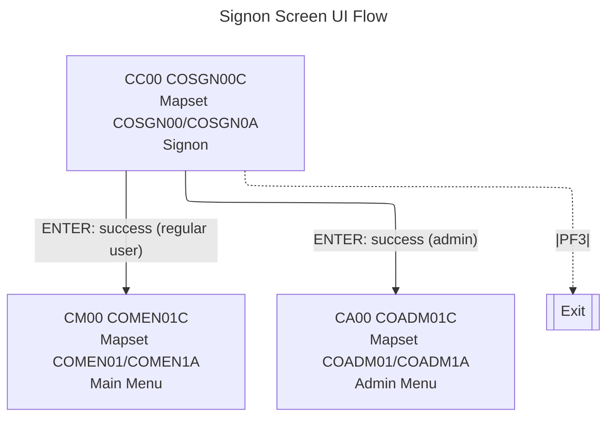

# COSGN00 — Signon Screen

- __Transaction ID__: CC00 (from `WS-TRANID` in `app/cbl/COSGN00C.cbl`)
- __Program__: `COSGN00C`
- __BMS Mapset/Map__: `COSGN00` / `COSGN0A`
- __Datasets__: `USRSEC` (user security) via `WS-USRSEC-FILE`
- __PF-Keys__:
  - ENTER: Validate User ID/Password. On success:
    - If admin (`CDEMO-USRTYP-ADMIN`) → XCTL `COADM01C` (Admin Menu).
    - Else → XCTL `COMEN01C` (Main Menu).
  - PF3: Exit session. Sends plain text "Thank You" and `RETURN`.

## Navigation flow (Signon → Main Menu)

* __Sources__
  - `app/cbl/COSGN00C.cbl` — validation logic, `WS-TRANID='CC00'`, branching to `COMEN01C` (CM00) or `COADM01C` (CA00), PF3 behavior.
  - `app/cbl/COMEN01C.cbl` — `WS-TRANID='CM00'`, PF3 returns to `COSGN00C`.
  - `app/bms/COSGN00.bms`, `app/bms/COMEN01.bms` — mapset/map names and footer labels.

## UI elements (extracted from `app/bms/COSGN00.bms`)

- __Static labels__:
  - "Tran :" at (1,1) — blue
  - "Date :" at (1,64) — blue
  - "Prog :" at (2,1) — blue
  - "Time :" at (2,64) — blue
  - "AppID:" at (3,1) — blue
  - "SysID:" at (3,64) — blue
  - "This is a Credit Card Demo Application for Mainframe Modernization" at (5,6) — neutral
  - ASCII banner lines at rows 7..15, column 21 — blue
  - "Type your User ID and Password, then press ENTER:" at (17,16) — turquoise
  - "User ID     :" at (19,29) — turquoise
  - "(8 Char)" at (19,52) — blue
  - "Password    :" at (20,29) — turquoise
  - "(8 Char)" at (20,52) — blue
  - Footer "ENTER=Sign-on  F3=Exit" at (24,1) — yellow

- __Fields__:
  - `TRNNAME` length 4 at (1,8) — blue, ASKIP FSET
  - `TITLE01` length 40 at (1,21) — yellow, ASKIP FSET
  - `CURDATE` length 8 at (1,71) — blue, ASKIP FSET, init 'mm/dd/yy'
  - `PGMNAME` length 8 at (2,8) — blue, FSET PROT
  - `TITLE02` length 40 at (2,21) — yellow, ASKIP FSET
  - `CURTIME` length 9 at (2,71) — blue, FSET PROT, init 'Ahh:mm:ss'
  - `APPLID` length 8 at (3,8) — blue, FSET PROT
  - `SYSID` length 8 at (3,71) — blue, FSET PROT, init '        '
  - `USERID` length 8 at (19,43) — green, FSET UNPROT, IC
  - (unnamed) length 0 at (19,52) — green, ASKIP NORM (spacer)
  - `PASSWD` length 8 at (20,43) — green, DRK, FSET, UNPROT, init '________'
  - (unnamed) length 0 at (20,52) — green, ASKIP NORM (spacer)
  - (unnamed) length 1 at (20,61) — DRK, UNPROT
  - (unnamed) length 0 at (20,63) — ASKIP NORM
  - `ERRMSG` length 78 at (23,1) — red, bright, FSET

## Notes
- Mapset header: CTRL(ALARM, FREEKB), EXTATT=YES, TIOAPFX=YES, STORAGE=AUTO, MODE=INOUT, LANG=COBOL
