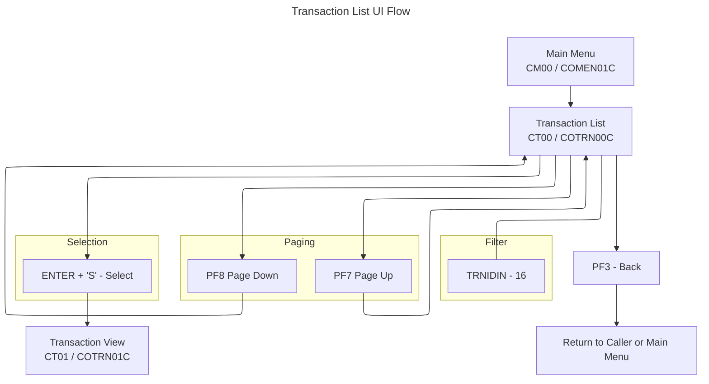

# Transaction List UI Flow (COTRN00C / COTRN00)

This document summarizes the Transaction List flow and UI, derived from COBOL program `app/cbl/COTRN00C.cbl` and BMS map `app/bms/COTRN00.bms`.

## Summary
- Lists transactions with optional start key filter by Transaction ID (`TRNIDIN`).
- 10 rows per page with paging via PF7 (back) and PF8 (forward).
- On ENTER, allows one-row selection:
  - Type `S` (or `s`) = view transaction details (navigates to Transaction View).
- Screen is read-only; it browses the `TRANSACT` file and does not update it.

## Diagrams
Application Flow (Mermaid)

## Transaction, Program, Mapset/Map
- Transaction: `CT00` (`WS-TRANID`)
- Program: `COTRN00C` (`WS-PGMNAME`)
- Mapset: `COTRN00`
- Map: `COTRN0A`

## Datasets and Operations
- Primary file: `TRANSACT` (`WS-TRANSACT-FILE`)
  - Browse with `EXEC CICS STARTBR/READNEXT/READPREV/ENDBR`.
  - Key: `TRAN-ID` (RIDFLD) optionally set from input `TRNIDIN` if numeric; blank input starts from low-values.

## PF-Key Handling
- Valid AIDs handled in `MAIN-PARA` after `RECEIVE-TRNLST-SCREEN`:
  - `ENTER`: `PROCESS-ENTER-KEY` (selection and initial browse)
  - `PF3`: Exit via `XCTL` to caller or Main Menu (`COMEN01C`)
  - `PF7`: `PROCESS-PF7-KEY` (page up)
  - `PF8`: `PROCESS-PF8-KEY` (page down)
  - Other: set error flag and message (`CCDA-MSG-INVALID-KEY`) and re-send screen
- Footer (BMS static): `ENTER=Continue  F3=Back  F7=Backward  F8=Forward`

## Behavior and Flow
- Entry and initialization:
  - Fresh start (`EIBCALEN = 0`): return to sign-on (`COSGN00C`).
  - First entry: initialize map (`LOW-VALUES`), run `PROCESS-ENTER-KEY`, then `SEND-TRNLST-SCREEN`.
- Selection and search (`PROCESS-ENTER-KEY`):
  - Checks selection cells `SEL0001..SEL0010`. If any have non-blank, move code to `CDEMO-CT00-TRN-SEL-FLG` and the corresponding `TRNIDxx` to `CDEMO-CT00-TRN-SELECTED`.
  - If selection is `S` or `s`: `XCTL` to `COTRN01C` (Transaction View).
  - Otherwise, set `WS-MESSAGE` to "Invalid selection. Valid value is S" and reset cursor to `TRNIDIN`.
  - Search start key: if `TRNIDIN` blank → `TRAN-ID = LOW-VALUES`; if non-blank and numeric → use as `TRAN-ID`; else error "Tran ID must be Numeric ..." and position cursor.
  - Initializes paging (`CDEMO-CT00-PAGE-NUM = 0`) then calls `PROCESS-PAGE-FORWARD`.
- Paging forward (`PROCESS-PAGE-FORWARD`):
  - `STARTBR` at `TRAN-ID`, `READNEXT` to fill up to 10 rows, set `CDEMO-CT00-TRNID-FIRST` and `...-LAST` and compute `CDEMO-CT00-PAGE-NUM`.
  - Sets `CDEMO-CT00-NEXT-PAGE-FLG` based on lookahead `READNEXT`.
  - Sends screen with updated `PAGENUM`.
- Paging backward (`PROCESS-PAGE-BACKWARD`):
  - `STARTBR` then `READPREV` to fill previous 10 rows starting from `CDEMO-CT00-TRNID-FIRST`.
  - Adjusts `CDEMO-CT00-PAGE-NUM` if possible; otherwise sets to 1.
  - Sends screen with updated `PAGENUM`.
- Boundary and error handling messages are set in `STARTBR/READNEXT/READPREV` evaluate blocks.

## Navigation
- From Main Menu: `COMEN01C` (`CM00`) → this screen (`COTRN00C`/`CT00`).
- To Transaction View: `COTRN01C` (`CT01`), mapset `COTRN01`, map `COTRN1A`.
- Exit (`PF3`): `XCTL` to caller or Main Menu (`COMEN01C`).

## UI Elements (extracted from BMS `app/bms/COTRN00.bms`)
- Header:
  - Literal "Tran:" at (1,1)
  - `TRNNAME` length 4, ASKIP FSET BLUE at (1,7)
  - `TITLE01` length 40, ASKIP FSET YELLOW at (1,21)
  - Literal "Date:" at (1,65)
  - `CURDATE` length 8, ASKIP FSET BLUE at (1,71), initial `mm/dd/yy`
  - Literal "Prog:" at (2,1)
  - `PGMNAME` length 8, ASKIP FSET BLUE at (2,7)
  - `TITLE02` length 40, ASKIP FSET YELLOW at (2,21)
  - Literal "Time:" at (2,65)
  - `CURTIME` length 8, ASKIP FSET BLUE at (2,71), initial `hh:mm:ss`
- Title and page:
  - Literal "List Transactions" at (4,30)
  - Literal "Page:" at (4,65)
  - `PAGENUM` length 8, ASKIP FSET BLUE at (4,71)
- Filter:
  - Prompt "Search Tran ID:" TURQUOISE at (6,5)
  - `TRNIDIN` length 16, UNPROT, GREEN, UNDERLINE, FSET at (6,21)
- Column headers and separators:
  - "Sel" at (8,2)
  - " Transaction ID " at (8,8)
  - "  Date  " at (8,27)
  - "     Description          " at (8,38)
  - "   Amount   " at (8,67)
  - Separator dashes at row 9
- Row fields (10 rows): for i = 1..10
  - `SEL000i` length 1, UNPROT, GREEN, UNDERLINE, FSET at (9+i,3)
  - `TRNID0i` length 16, ASKIP FSET BLUE at (9+i,8)
  - `TDATE0i` length 8, ASKIP FSET BLUE at (9+i,27)
  - `TDESC0i` length 26, ASKIP FSET BLUE at (9+i,38)
  - `TAMT00i` length 12, ASKIP FSET BLUE at (9+i,67)
- Messages:
  - Instruction text at (21,12): "Type 'S' to View Transaction details from the list"
  - `ERRMSG` length 78, BRT, RED, FSET at (23,1)
- Footer:
  - Static at (24,1): `ENTER=Continue  F3=Back  F7=Backward  F8=Forward`

## Key Paragraph References (in `app/cbl/COTRN00C.cbl`)
- `MAIN-PARA` (program entry, AID dispatch)
- `PROCESS-ENTER-KEY` (selection and search start key logic)
- `PROCESS-PF7-KEY` and `PROCESS-PF8-KEY` (paging controls)
- `PROCESS-PAGE-FORWARD` and `PROCESS-PAGE-BACKWARD` (page population)
- `POPULATE-HEADER-INFO` (header fields and date/time)
- `SEND-TRNLST-SCREEN` and `RECEIVE-TRNLST-SCREEN` (map I/O)
- `STARTBR-TRANSACT-FILE`, `READNEXT-TRANSACT-FILE`, `READPREV-TRANSACT-FILE`, `ENDBR-TRANSACT-FILE`
- `RETURN-TO-PREV-SCREEN` (XCTL transfer with context)

## Notable Messages (from code)
- "Invalid selection. Valid value is S"
- "Tran ID must be Numeric ..."
- "You are at the top of the page..." (on `STARTBR` not found)
- "You have reached the top of the page..." (on `READPREV` end)
- "You have reached the bottom of the page..." (on `READNEXT` end)
- "You are already at the top of the page..." (PF7 at top)
- "You are already at the bottom of the page..." (PF8 at bottom)
- "Unable to lookup transaction..."
- Invalid key message constant: `CCDA-MSG-INVALID-KEY`

## Related Screens
- Transaction View: [COTRN01.md](./COTRN01.md)
- Transaction Add: [COTRN02.md](./COTRN02.md)

## Notes
- Selection accepts only `S`/`s`; any other non-blank code results in an inline error and the cursor returning to `TRNIDIN`.
- The browse start key uses `TRNIDIN` only if numeric; otherwise an error is shown and paging is not performed.
- `CDEMO-CT00-TRNID-FIRST` and `CDEMO-CT00-TRNID-LAST` are maintained to support PF7/PF8 paging and page numbering.
