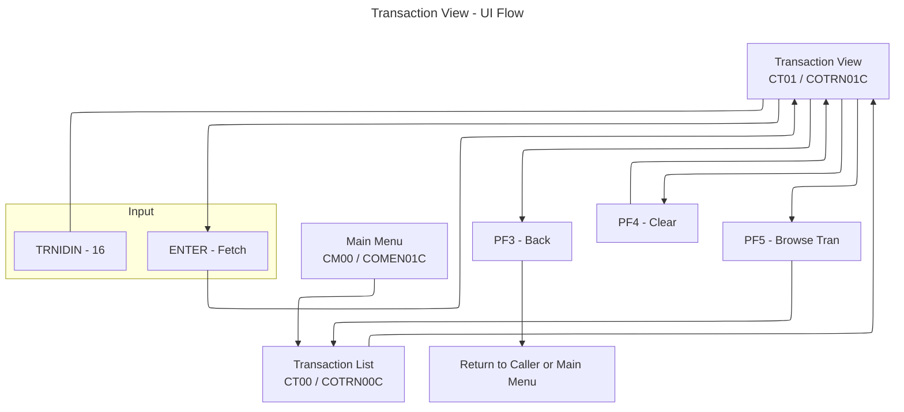

# Transaction View UI Flow (COTRN01C / COTRN01)

This document summarizes the Transaction View flow and UI, derived from COBOL program `app/cbl/COTRN01C.cbl` and BMS map `app/bms/COTRN01.bms`.

## Summary
- View details for a single transaction by Transaction ID.
- ENTER fetches the record from `TRANSACT` and populates the screen.
- PF3 returns to the caller or Main Menu. PF4 clears the screen. PF5 returns to Transaction List.

## Diagrams
Application Flow (Mermaid)

## Transaction, Program, Mapset/Map
- Transaction: `CT01` (`WS-TRANID`)
- Program: `COTRN01C` (`WS-PGMNAME`)
- Mapset: `COTRN01`
- Map: `COTRN1A`

## Datasets and Operations
- Primary file: `TRANSACT` (`WS-TRANSACT-FILE`)
  - Read by key using `EXEC CICS READ` with `RIDFLD(TRAN-ID)` and `KEYLENGTH(LENGTH OF TRAN-ID)`.
  - The program issues `UPDATE` on the READ to obtain the record for update, but this screen does not modify the record.

## PF-Key Handling
- In `MAIN-PARA` after `RECEIVE-TRNVIEW-SCREEN`:
  - `ENTER`: `PROCESS-ENTER-KEY` (validates `TRNIDIN`, reads file, populates fields)
  - `PF3`: If `CDEMO-FROM-PROGRAM` present return to it, else to Main Menu (`COMEN01C`), via `RETURN-TO-PREV-SCREEN`
  - `PF4`: `CLEAR-CURRENT-SCREEN` (re-initialize input and output fields)
  - `PF5`: Set `CDEMO-TO-PROGRAM` to `COTRN00C` and `XCTL` back to Transaction List
  - Other: set error flag and message `CCDA-MSG-INVALID-KEY`, then re-send screen
- Footer (BMS static): `ENTER=Fetch  F3=Back  F4=Clear  F5=Browse Tran.`

## Behavior and Flow
- Entry and initialization:
  - Fresh start (`EIBCALEN = 0`): send user to sign-on (`COSGN00C`).
  - First entry: initialize map to `LOW-VALUES`, set cursor to `TRNIDIN`.
    - If coming from list with a selected ID (`CDEMO-CT01-TRN-SELECTED` set), prefill `TRNIDIN` and auto-execute `PROCESS-ENTER-KEY`.
  - Subsequent entries: receive map and dispatch on AID.
- ENTER processing (`PROCESS-ENTER-KEY`):
  - If `TRNIDIN` blank → error "Tran ID can NOT be empty..." and cursor to `TRNIDIN`.
  - Else clear output fields, move `TRNIDIN` to `TRAN-ID`, and `READ-TRANSACT-FILE`.
  - On successful read: move fields to `TRNID`, `CARDNUM`, `TTYPCD`, `TCATCD`, `TRNSRC`, `TRNAMT`, `TDESC`, `TORIGDT`, `TPROCDT`, `MID`, `MNAME`, `MCITY`, `MZIP`; then send screen.
- Error handling in `READ-TRANSACT-FILE`:
  - `NOTFND`: "Transaction ID NOT found..." and cursor to `TRNIDIN`.
  - Other RESP: "Unable to lookup Transaction..." and cursor to `TRNIDIN`.

## Navigation
- From Transaction List: `COTRN00C` (`CT00`) → this screen (`COTRN01C`/`CT01`).
- Exit (`PF3`): `XCTL` to caller or Main Menu (`COMEN01C`).
- Clear (`PF4`): re-initialize current screen fields.
- Browse (`PF5`): `XCTL` to Transaction List (`COTRN00C`).

## UI Elements (extracted from BMS `app/bms/COTRN01.bms`)
- Header:
  - Literal "Tran:" at (1,1)
  - `TRNNAME` length 4, ASKIP FSET BLUE at (1,7)
  - `TITLE01` length 40, ASKIP FSET YELLOW at (1,21)
  - Literal "Date:" at (1,65)
  - `CURDATE` length 8, ASKIP FSET BLUE at (1,71), initial `mm/dd/yy`
  - Literal "Prog:" at (2,1)
  - `PGMNAME` length 8, ASKIP FSET BLUE at (2,7)
  - `TITLE02` length 40, ASKIP FSET YELLOW at (2,21)
  - Literal "Time:" at (2,65)
  - `CURTIME` length 8, ASKIP FSET BLUE at (2,71), initial `hh:mm:ss`
- Title and input:
  - Literal "View Transaction" BRT NEUTRAL at (4,30)
  - Prompt "Enter Tran ID:" TURQUOISE at (6,6)
  - `TRNIDIN` length 16, UNPROT, GREEN, UNDERLINE, FSET, IC at (6,21)
  - Separator dashes at row 8
- Detail fields:
  - Label "Transaction ID:" at (10,6); `TRNID` BLUE length 16 at (10,22)
  - Label "Card Number:" at (10,45); `CARDNUM` BLUE length 16 at (10,58)
  - Label "Type CD:" at (12,6); `TTYPCD` BLUE length 2 at (12,15)
  - Label "Category CD:" at (12,23); `TCATCD` BLUE length 4 at (12,36)
  - Label "Source:" at (12,46); `TRNSRC` BLUE length 10 at (12,54)
  - Label "Description:" at (14,6); `TDESC` BLUE length 60 at (14,19)
  - Label "Amount:" at (16,6); `TRNAMT` BLUE length 12 at (16,14)
  - Label "Orig Date:" at (16,31); `TORIGDT` BLUE length 10 at (16,42)
  - Label "Proc Date:" at (16,57); `TPROCDT` BLUE length 10 at (16,68)
  - Label "Merchant ID:" at (18,6); `MID` BLUE length 9 at (18,19)
  - Label "Merchant Name:" at (18,33); `MNAME` BLUE length 30 at (18,48)
  - Label "Merchant City:" at (20,6); `MCITY` BLUE length 25 at (20,21)
  - Label "Merchant Zip:" at (20,53); `MZIP` BLUE length 10 at (20,67)
- Messages:
  - `ERRMSG` length 78, BRT, RED, FSET at (23,1)
- Footer:
  - Static at (24,1): `ENTER=Fetch  F3=Back  F4=Clear  F5=Browse Tran.`

## Key Paragraph References (in `app/cbl/COTRN01C.cbl`)
- `MAIN-PARA` (program entry, AID dispatch)
- `PROCESS-ENTER-KEY` (validate input, load and display record)
- `READ-TRANSACT-FILE` (CICS READ and RESP handling)
- `SEND-TRNVIEW-SCREEN` and `RECEIVE-TRNVIEW-SCREEN` (map I/O)
- `POPULATE-HEADER-INFO` (header fields and date/time)
- `CLEAR-CURRENT-SCREEN` and `INITIALIZE-ALL-FIELDS`
- `RETURN-TO-PREV-SCREEN` (XCTL transfer)

## Notable Messages (from code)
- "Tran ID can NOT be empty..."
- "Transaction ID NOT found..."
- "Unable to lookup Transaction..."
- Invalid key message constant: `CCDA-MSG-INVALID-KEY`

## Related Screens
- Transaction List: [COTRN00.md](./COTRN00.md)
- Transaction Add: [COTRN02.md](./COTRN02.md)

## Notes
- When invoked from the list with a selected transaction, the program pre-fills `TRNIDIN` and immediately fetches the record.
- `READ` is issued with `UPDATE`, but no modifications are made on this screen.
