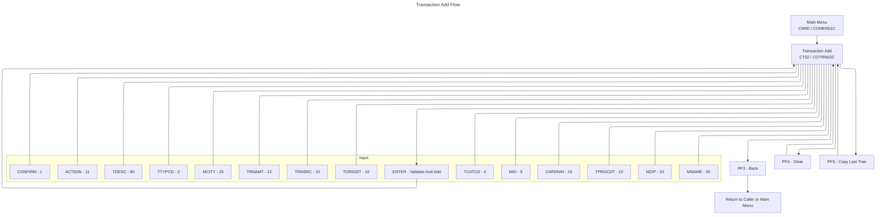

# Transaction Add UI Flow (COTRN02C / COTRN02)

This document summarizes the Transaction Add flow and UI, derived from COBOL program `app/cbl/COTRN02C.cbl` and BMS map `app/bms/COTRN02.bms`.

## Summary
- Add a new transaction to `TRANSACT` by providing Account ID or Card Number and transaction details.
- ENTER validates keys and data. Confirmation required in CONFIRM field. On Y the record is written.
- PF3 returns to the caller or Main Menu. PF4 clears the screen. PF5 copies the last transaction into fields and proceeds to validation.

## Diagrams
Application Flow (Mermaid)

## Transaction, Program, Mapset/Map
- Transaction: `CT02` (`WS-TRANID`)
- Program: `COTRN02C` (`WS-PGMNAME`)
- Mapset: `COTRN02`
- Map: `COTRN2A`

## Datasets and Operations
- Primary file: `TRANSACT` (`WS-TRANSACT-FILE`)
  - To generate next `TRAN-ID`: `STARTBR` at `HIGH-VALUES`, `READPREV` last record, `ENDBR`, increment last id.
  - Add record: `WRITE` with `RIDFLD(TRAN-ID)` and `KEYLENGTH(LENGTH OF TRAN-ID)`.
- Cross-reference files for key resolution:
  - `CXACAIX` (`WS-CXACAIX-FILE`) read by `XREF-ACCT-ID` when Account ID entered to fetch Card Number.
  - `CCXREF` (`WS-CCXREF-FILE`) read by `XREF-CARD-NUM` when Card Number entered to fetch Account ID.
- Utility call:
  - `CALL 'CSUTLDTC'` validates `TORIGDT` and `TPROCDT` against date format `YYYY-MM-DD`.

## PF-Key Handling
- In `MAIN-PARA` after `RECEIVE-TRNADD-SCREEN`:
  - `ENTER`: `PROCESS-ENTER-KEY` then dispatch by `CONFIRM`:
    - `Y` or `y`: `ADD-TRANSACTION`
    - `N` or `n`, blank or low-values: error "Confirm to add this transaction..." with cursor to `CONFIRM`
    - Other: error "Invalid value. Valid values are Y or N..." with cursor to `CONFIRM`
  - `PF3`: If `CDEMO-FROM-PROGRAM` present return to it, else to Main Menu (`COMEN01C`) via `RETURN-TO-PREV-SCREEN`
  - `PF4`: `CLEAR-CURRENT-SCREEN` (re-initialize all fields)
  - `PF5`: `COPY-LAST-TRAN-DATA` (browse last transaction and copy values, then continues with `PROCESS-ENTER-KEY`)
  - Other: set error flag and message `CCDA-MSG-INVALID-KEY`, then re-send screen
- Footer (BMS static): `ENTER=Continue  F3=Back  F4=Clear  F5=Copy Last Tran.`

## Behavior and Flow
- Entry and initialization:
  - Fresh start (`EIBCALEN = 0`): send user to sign-on (`COSGN00C`).
  - First entry: initialize map to `LOW-VALUES`, set cursor to `ACTIDIN`.
    - If arriving with a selected Card Number (`CDEMO-CT02-TRN-SELECTED` set), prefill `CARDNIN` and auto-execute `PROCESS-ENTER-KEY`.
  - Subsequent entries: receive map and dispatch on AID.
- Key validation (`VALIDATE-INPUT-KEY-FIELDS`):
  - If `ACTIDIN` present and numeric: move to `XREF-ACCT-ID`, `READ` `CXACAIX`, set `CARDNIN` from `XREF-CARD-NUM`.
  - Else if `CARDNIN` present and numeric: move to `XREF-CARD-NUM`, `READ` `CCXREF`, set `ACTIDIN` from `XREF-ACCT-ID`.
  - Else: error "Account or Card Number must be entered..." and cursor to `ACTIDIN`.
- Data validation (`VALIDATE-INPUT-DATA-FIELDS`):
  - On prior error, clears all non-key input fields before re-validating.
  - Required fields: `TTYPCD`, `TCATCD`, `TRNSRC`, `TDESC`, `TRNAMT`, `TORIGDT`, `TPROCDT`, `MID`, `MNAME`, `MCITY`, `MZIP`.
  - Numeric checks: `TTYPCD`, `TCATCD`, `MID` must be numeric.
  - Amount format: sign `-` or `+`, 8 digits, dot, 2 digits. Example `-99999999.99`.
  - Date format: `YYYY-MM-DD` for `TORIGDT` and `TPROCDT` plus validation via `CSUTLDTC`.
- Add flow (`ADD-TRANSACTION`):
  - Determine next `TRAN-ID` by browsing last record.
  - Populate `TRAN-RECORD` from map fields and `WRITE` to `TRANSACT`.
  - On success: clear screen fields, set success message in green "Transaction added successfully. Your Tran ID is <id>." and send screen.
  - On duplicate: error "Tran ID already exist...".
  - On other RESP: error "Unable to Add Transaction...".
- PF5 copy last (`COPY-LAST-TRAN-DATA`):
  - Validate key fields, browse last transaction, copy fields into inputs, then `PROCESS-ENTER-KEY`.

## Navigation
- From Main Menu: `COMEN01C` (`CM00`) → this screen (`COTRN02C`/`CT02`).
- Exit (`PF3`): `XCTL` to caller or Main Menu (`COMEN01C`).
- Clear (`PF4`): re-initialize all current screen fields.
- Copy last (`PF5`): copies prior record values and proceeds to validation.

## UI Elements (extracted from BMS `app/bms/COTRN02.bms`)
- Header:
  - Literal "Tran:" at (1,1)
  - `TRNNAME` length 4, ASKIP FSET BLUE at (1,7)
  - `TITLE01` length 40, ASKIP FSET YELLOW at (1,21)
  - Literal "Date:" at (1,65)
  - `CURDATE` length 8, ASKIP FSET BLUE at (1,71), initial `mm/dd/yy`
  - Literal "Prog:" at (2,1)
  - `PGMNAME` length 8, ASKIP FSET BLUE at (2,7)
  - `TITLE02` length 40, ASKIP FSET YELLOW at (2,21)
  - Literal "Time:" at (2,65)
  - `CURTIME` length 8, ASKIP FSET BLUE at (2,71), initial `hh:mm:ss`
- Title and key input:
  - Literal "Add Transaction" BRT NEUTRAL at (4,30)
  - Prompt "Enter Acct #:" TURQUOISE at (6,6)
  - `ACTIDIN` length 11, UNPROT, GREEN, UNDERLINE, FSET, IC at (6,21)
  - Literal "(or)" NEUTRAL at (6,37)
  - Prompt "Card #:" TURQUOISE at (6,46)
  - `CARDNIN` length 16, UNPROT, GREEN, UNDERLINE, FSET at (6,55)
  - Separator dashes at row 8 from col 6, length 70
- Detail input fields:
  - Label "Type CD:" at (10,6); `TTYPCD` GREEN UNPROT UNDERLINE length 2 at (10,15)
  - Label "Category CD:" at (10,23); `TCATCD` GREEN UNPROT UNDERLINE length 4 at (10,36)
  - Label "Source:" at (10,46); `TRNSRC` GREEN UNPROT UNDERLINE length 10 at (10,54)
  - Label "Description:" at (12,6); `TDESC` GREEN UNPROT UNDERLINE length 60 at (12,19)
  - Label "Amount:" at (14,6); `TRNAMT` GREEN UNPROT UNDERLINE length 12 at (14,14)
  - Label "Orig Date:" at (14,31); `TORIGDT` GREEN UNPROT UNDERLINE length 10 at (14,42)
  - Label "Proc Date:" at (14,57); `TPROCDT` GREEN UNPROT UNDERLINE length 10 at (14,68)
  - Blue hints: `(-99999999.99)` at (15,13), `(YYYY-MM-DD)` at (15,41) and (15,67)
  - Label "Merchant ID:" at (16,6); `MID` GREEN UNPROT UNDERLINE length 9 at (16,19)
  - Label "Merchant Name:" at (16,33); `MNAME` GREEN UNPROT UNDERLINE length 30 at (16,48)
  - Label "Merchant City:" at (18,6); `MCITY` GREEN UNPROT UNDERLINE length 25 at (18,21)
  - Label "Merchant Zip:" at (18,53); `MZIP` GREEN UNPROT UNDERLINE length 10 at (18,67)
- Confirmation and messages:
  - Literal "You are about to add this transaction. Please confirm :" at (21,6)
  - `CONFIRM` GREEN UNPROT UNDERLINE length 1 at (21,63) with literal "(Y/N)" at (21,66)
  - `ERRMSG` length 78, BRT, RED, FSET at (23,1)
- Footer:
  - Static at (24,1): `ENTER=Continue  F3=Back  F4=Clear  F5=Copy Last Tran.`

## Key Paragraph References (in `app/cbl/COTRN02C.cbl`)
- `MAIN-PARA` (program entry, AID dispatch)
- `PROCESS-ENTER-KEY` (validate keys and data, confirm, add)
- `VALIDATE-INPUT-KEY-FIELDS`, `VALIDATE-INPUT-DATA-FIELDS`
- `ADD-TRANSACTION`, `COPY-LAST-TRAN-DATA`
- `READ-CCXREF-FILE`, `READ-CXACAIX-FILE` (cross-reference lookups)
- `STARTBR-TRANSACT-FILE`, `READPREV-TRANSACT-FILE`, `ENDBR-TRANSACT-FILE`, `WRITE-TRANSACT-FILE`
- `SEND-TRNADD-SCREEN` and `RECEIVE-TRNADD-SCREEN` (map I/O)
- `POPULATE-HEADER-INFO` (header fields and date/time)
- `CLEAR-CURRENT-SCREEN` and `INITIALIZE-ALL-FIELDS`
- `RETURN-TO-PREV-SCREEN` (XCTL transfer)

## Notable Messages (from code)
- "Account or Card Number must be entered..."
- "Account ID must be Numeric..."
- "Card Number must be Numeric..."
- "Type CD can NOT be empty..."
- "Category CD can NOT be empty..."
- "Source can NOT be empty..."
- "Description can NOT be empty..."
- "Amount can NOT be empty..."
- "Orig Date can NOT be empty..."
- "Proc Date can NOT be empty..."
- "Type CD must be Numeric..."
- "Category CD must be Numeric..."
- "Amount should be in format -99999999.99"
- "Orig Date should be in format YYYY-MM-DD"
- "Proc Date should be in format YYYY-MM-DD"
- "Orig Date - Not a valid date..."
- "Proc Date - Not a valid date..."
- "Merchant ID must be Numeric..."
- "Transaction added successfully. Your Tran ID is <id>."
- "Tran ID already exist..."
- "Unable to Add Transaction..."
- Invalid key message constant: `CCDA-MSG-INVALID-KEY`

## Related Screens
- Transaction List: [COTRN00.md](./COTRN00.md)
- Transaction View: [COTRN01.md](./COTRN01.md)

## Notes
- `CONFIRM` must be Y to proceed with add; N or blank results in a prompt to confirm.
- Date validation includes a utility call to `CSUTLDTC`. Non-zero severity is allowed only when message 2513 is returned. Otherwise, the date is considered invalid.
- On successful add, the program clears fields and shows success in green by setting `ERRMSGC` to `DFHGREEN`.
