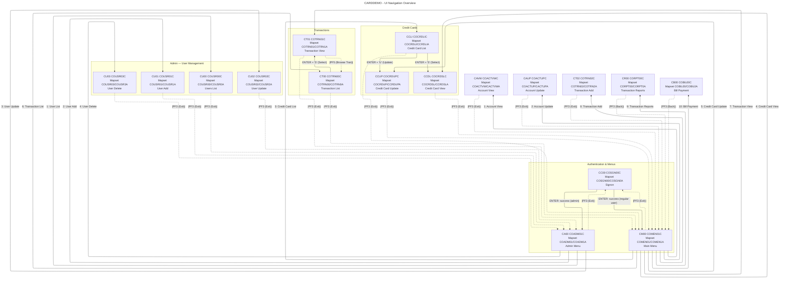

# UI Navigation Overview — Unified Diagram

This document presents a unified, high-level navigation overview of the CARDDEMO application. It consolidates flows from the individual UI screen documents under `docs/ui-flow/`.

- Sources: `COSGN00.md`, `COMEN01.md`, `COADM01.md`, `COACTVW.md`, `COACTUP.md`, `COCRDLI.md`, `COCRDSL.md`, `COTRN00.md`, `COTRN01.md`, `COTRN02.md`, `CORPT00.md`, `COBIL00.md`.
- Conventions:
  - Dotted edges represent PF-key “back/exit” or return flows.
  - Edge labels reflect menu options or selection codes where applicable.

## Notes
- PF-key behaviors (PF3/PF4/PF5) are summarized as back/clear/browse where applicable. See individual screens for field-level details and dataset operations.
- Some screens (e.g., Credit Card Update `COCRDUPC`, User Management programs `COUSR00C`..`COUSR03C`) are referenced by the menus and list flows even if a dedicated UI flow markdown is not present here.
